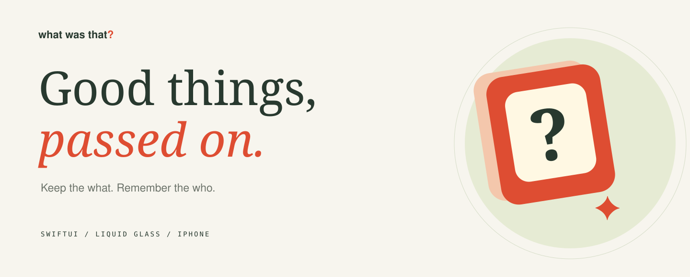
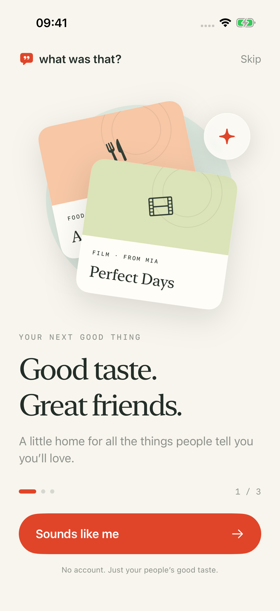
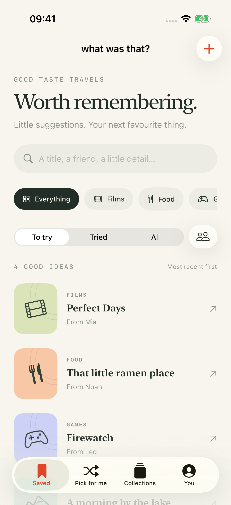
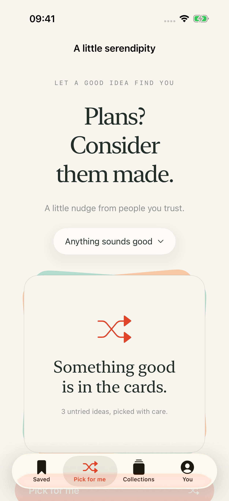
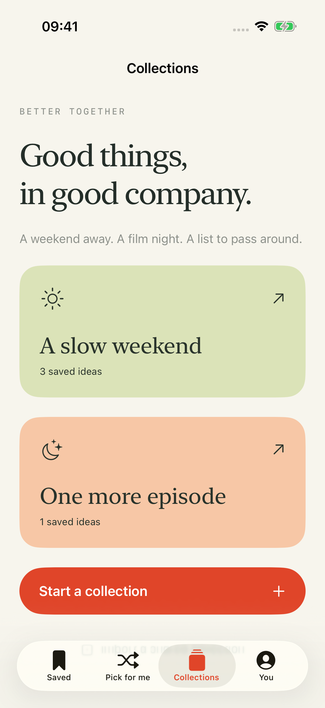

<p align="center"></p>

<p align="center">
  <a href="https://platret.github.io/what-was-that/">Meet the app</a> ·
  <a href="https://github.com/platret/what-was-that/releases/latest">Download</a> ·
  <a href="#run-on-your-iphone">Run on iPhone</a> ·
  <a href="https://platret.github.io/what-was-that/privacy.html">Privacy</a>
</p>

<p align="center"><strong>The film Mia mentioned. That tiny ramen place. The game you meant to remember.</strong><br>A private little home for recommendations from people you trust.</p>

---

## Keep the what. Remember the who.

**What Was That?** is a native SwiftUI app for iPhone. Save the things friends tell you you’ll love, keep the person and the little details attached, and pick something when “what should we do?” comes up.

Warm ivory, ink, sage, and coral. Serif headlines. Native Liquid Glass navigation and controls. Spring transitions, gentle haptics, and a three-step welcome. Written in concise English, with system light and dark appearances and reduced-motion support.

<p align="center">
  
  
  
  
</p>
<p align="center"><sub>Actual iOS Simulator screenshots. Names and recommendations shown are fictional examples.</sub></p>

## The little details

| Feature | What it does |
| --- | --- |
| **Saved ideas** | Films, food, games, places, and everything else. Add a title, friend, note, optional link, and collection. |
| **People, remembered** | Search titles, notes, or names. Filter by category, friend, favourites, or tried status. |
| **Pick for me** | Randomly choose an untried idea, optionally by category. Avoid the immediately previous pick when alternatives exist. |
| **Collections** | Gather a weekend, film night, or trip. Removing a collection keeps its recommendations. |
| **Pass it on** | Share a recommendation as text, or a `.wwt` collection file through the system share sheet. Preview imports; repeated imports do not create duplicates or overwrite existing edits. |
| **Custom widgets** | Small and medium Home Screen widgets. Choose a category, collection, and one of four colours. Tap a suggestion to open it in the app. |
| **Your library, yours** | Atomic local saves, exportable JSON backups, and confirmed backup restore. Failed reads preserve the original file. |

### About the Pro idea

Shared collections and custom widgets are **included in this developer edition**. No paywall, subscription, or pretend purchase flow is implemented. Collection sharing sends a snapshot; it is **not live collaborative sync**. A commercial Pro edition, StoreKit billing, and cloud collaboration would be separate future work.

## Run on your iPhone

Requires **Xcode 26 or later**, **iOS 26 or later**, a Mac, and an Apple development team capable of provisioning the app and its App Group.

1. [Download the latest source release](https://github.com/platret/what-was-that/releases/latest), unzip it, and open `WhatWasThat.xcodeproj`.
2. In **Signing & Capabilities**, choose your development team for **WhatWasThat** and **WhatWasThatWidgets**. The checked-in project uses the original developer’s team; replace it for your own build.
3. Use your own unique bundle identifiers for both targets. The widget identifier must begin with the app identifier.
4. Register one App Group and enable it for both targets. Update `WWT_APP_GROUP` in both targets and `sharedGroup` in `Shared/Models.swift` to the same value. The supplied group is `group.com.platret.whatwasthat.shared`.
5. Connect your iPhone, trust the Mac, and enable Developer Mode if prompted.
6. Select your iPhone as the run destination, then **Run** (`⌘R`).

The app starts empty with onboarding. Optional fictional examples are available under **You → Explore with sample recommendations** while the library is empty. There are no API keys, server setup, or package dependencies.

**Widgets:** hold the Home Screen → Edit → Add Widget → What Was That?. Choose a size. Hold the installed widget → Edit Widget to choose the category, collection, and colour. WidgetKit controls actual refresh timing; the app requests updates after successful saves.

**Signing in synced folders:** if macOS adds Finder metadata to build products and code signing reports “resource fork, Finder information, or similar detritus not allowed”, put Derived Data outside iCloud/Dropbox, such as `/tmp/whatwasthat-device-build`.

The download is a **source release**, not a universally installable IPA. App Store and TestFlight distribution are not configured. Development installs remain subject to Apple’s provisioning rules.

## Build and test

```sh
xcodebuild -project WhatWasThat.xcodeproj -scheme WhatWasThat \
  -destination 'generic/platform=iOS Simulator' \
  -derivedDataPath /tmp/whatwasthat-simulator \
  build CODE_SIGNING_ALLOWED=NO
```

Choose an available iPhone simulator ID from `xcrun simctl list devices available`:

```sh
xcodebuild -project WhatWasThat.xcodeproj -scheme WhatWasThat \
  -destination 'platform=iOS Simulator,id=YOUR_SIMULATOR_ID' \
  -derivedDataPath /tmp/whatwasthat-tests \
  test CODE_SIGNING_ALLOWED=NO ONLY_ACTIVE_ARCH=YES
```

Unit tests cover persistence, editing/deletion, friend/category/search filters, import deduplication, unsafe-link rejection, and preserving corrupt files. UI journeys exercise onboarding, capture, searching, relaunch persistence, shuffling, collection creation, tried status, and the collection share sheet. See [validation notes](evidence/VALIDATION.md) for the actual device and test results.

## A small, native codebase

```text
WhatWasThat/             SwiftUI app, screens, observable store, assets
Shared/                  Codable models, disk storage, collection format
WhatWasThatWidgets/      WidgetKit + App Intents configurable widget
WhatWasThatTests/        Model and persistence tests
WhatWasThatUITests/      iPhone interaction journeys and screenshots
site/                    Responsive product site and interactive example
scripts/                 Deterministic Xcode project and icon generators
```

The app writes versioned JSON atomically inside the App Group container. The widget reads that same library. Changes become visible in the UI only after a successful disk write. No network requests are made by the app itself. External links and user-initiated sharing use system services.

The `.wwt` format is a versioned JSON collection package. Imports validate their format, version, size, and field lengths. A repeated import preserves recommendations already in your library. Exported backups contain the entire library; restoring one replaces the current library after confirmation.

To regenerate the Xcode project after adding Swift files:

```sh
python3 scripts/generate_project.py
```

The generator preserves the current project’s development team. Custom bundle identifier or App Group changes should also be reflected in the generator before regenerating.

## The website

[**platret.github.io/what-was-that**](https://platret.github.io/what-was-that/)

A responsive, static product page with real app screenshots, an interactive recommendation picker using fictional samples, privacy information, and installation instructions. No build step or analytics. Google Fonts supplies Instrument Serif and DM Sans; system fallbacks are provided. GitHub Actions deploys `site/` to GitHub Pages.

```sh
python3 -m http.server 4173 --bind 127.0.0.1 --directory site
```

## Privacy

Recommendations stay on your device. There is no account, telemetry, advertising SDK, or app backend. Sharing explicitly sends the chosen names, titles, notes, and links. Device backups may include app data according to your settings. See the [privacy policy](https://platret.github.io/what-was-that/privacy.html).

---

<p align="center">Made with care by <a href="https://github.com/platret">platret</a>.<br><em>Good things, passed on.</em></p>
